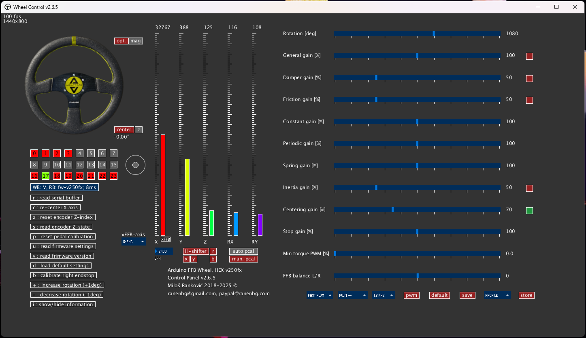
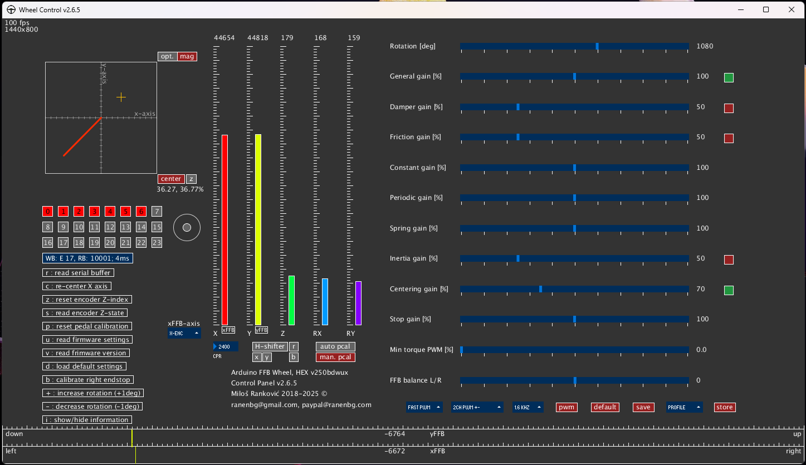

# Arduino-FFB-gui

A graphical user interface for controlling and monitoring all aspects of the **[Arduino FFB wheel](https://github.com/ranenbg/Arduino-FFB-wheel)** via RS232 serial port. Wheel control v2.6.5 supports Arduino HEX firmware v250 and is backward compatible with v240, v230, v220, v210, v200, v190, v180 and v170. You can use a stand-alone wheel_control.exe file from the **[latest release](https://github.com/ranenbg/Arduino-FFB-gui/releases/latest)**, it already has all Java stuff embedded. For more details on how to set up and use the program correctly, please read the **[manual](https://github.com/ranenbg/Arduino-FFB-gui/tree/master/data/manual.txt)**. You can find some screenshots with step-by-step first-time run setup process in **[data](https://github.com/ranenbg/Arduino-FFB-gui/tree/master/data)** folder.

### Screenshot of GUI v2.6.5

## Download - standalone app
+ ***[Latest Release](https://github.com/ranenbg/Arduino-FFB-gui/releases/latest)***
+ ***[Past Versions](https://github.com/ranenbg/Arduino-FFB-gui/releases)***

## How to compile the source

The GUI is made in Processing 3.5.4 IDE from scratch and requires the latest Java 8. In order to compile the source yourself, you will need to install the following Processing libraries:

- Game Control Plus
- G4P (no longer required)
- Sprites
- ControlP5

Make sure that all pde files are located in the folder named wheel_control. Processing 3.5.4 IDE can be found here: <https://processing.org/download>

## Troubleshooting - first time run

The program will look for all virtual COM port devices plugged into your PC, but it doesn't know to which COM port your Arduino is assigned. You can either follow the first-time run setup process and select your Arduino COM port from there, or if you experience the "stuck in black screen issue," you can do it manually. Locate the data folder and create a txt file named COM_cfg.txt (do not put .txt in the file name, it is just the file extension). Open this file and type COMx, where x is the 1-digit number of the COM port where your Arduino is located. You can find it in the device manager under ports, an example is COM5. Save the file and close it, then try to run wheel control exe again as an administrator. If the problem still persists, you may try to install Processing IDE 3.5.4, download missing libraries, and try to run it as the source code from there. Note that you must place all *.pde files from the source folder into a folder named wheel_control.
